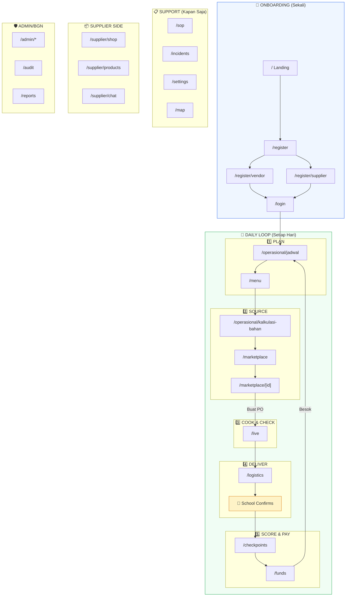

# The Main Flow — MBG Vendor Platform

## Masalah Kamu

> "Gw punya banyak page tapi bingung main flownya akan seperti apa"

Kamu punya **25+ halaman** yang bagus secara individual, tapi belum ada **satu garis cerita** yang menghubungkan semuanya. Dokumen ini menjawab: **apa alur utama yang harus dibangun, dan di mana setiap page masuk.**

---

## Jawaban Singkat

Platform MBG punya **1 loop utama** yang berputar setiap hari. Semua fitur lain adalah pendukung loop ini.

```
         ┌──────────────────────────────────────────────────────┐
         │              DAILY OPERATIONS LOOP                   │
         │                                                      │
         │   PLAN  →  SOURCE  →  COOK  →  DELIVER  →  GET PAID │
         │    ↑                                          │      │
         │    └──────────────────────────────────────────┘      │
         └──────────────────────────────────────────────────────┘
```

**Kalau loop ini belum jalan end-to-end, fitur lain tidak ada artinya.**

---

## The Daily Operations Loop (5 Langkah)

### Langkah 1: PLAN — "Hari ini masak apa?"

```
/portal/operasional/jadwal  →  /portal/menu
```

| Apa yang terjadi | Page |
|-----------------|------|
| Vendor buka kalender mingguan, lihat jadwal hari ini | `/portal/operasional/jadwal` |
| Klik "Ubah Menu" atau lihat menu yang sudah di-assign | `/portal/menu` |
| Input menu + jumlah porsi → sistem hitung nutrisi otomatis | `/portal/menu` (calculator) |
| Simpan menu → sistem cek compliance nutrisi | **❌ Belum ada API** |

### Langkah 2: SOURCE — "Bahan apa yang perlu dibeli?"

```
/portal/menu  →  /portal/operasional/kalkulasi-bahan  →  /portal/marketplace  →  /portal/marketplace/[id]
```

| Apa yang terjadi | Page |
|-----------------|------|
| Dari menu, klik "Lanjut Kalkulasi" | `/portal/operasional/kalkulasi-bahan` |
| Sistem hitung otomatis: butuh 52kg ayam, 65kg beras, dll | `/portal/operasional/kalkulasi-bahan` |
| Input stok dapur → sistem hitung selisih yang harus beli | `/portal/operasional/kalkulasi-bahan` |
| Klik "Lanjut ke E-Katalog" → browse supplier | `/portal/marketplace` |
| Pilih supplier → lihat produk, harga, legalitas | `/portal/marketplace/[id]` |
| Tambah ke keranjang → Buat PO (Purchase Order) | `/portal/marketplace/[id]` → **❌ PO belum ada API** |

### Langkah 3: COOK & CHECKPOINT — "Masak dan foto bukti"

```
/portal/live  (4 checkpoint steps)
```

| Apa yang terjadi | Page |
|-----------------|------|
| Pagi: Vendor mulai proses checkpoint | `/portal/live` |
| **CP1** — Foto bahan mentah yang diterima | `/portal/live` step 1 |
| **CP2** — Foto proses masak | `/portal/live` step 2 |
| **CP3** — Foto makanan siap kirim + timer safety | `/portal/live` step 3 |
| **CP4** — Foto bukti serah terima di sekolah | `/portal/live` step 4 |
| AI validasi setiap foto → pass/fail | **❌ Belum ada AI** |

### Langkah 4: DELIVER & CONFIRM — "Sekolah terima makanan"

```
/portal/live (step 4)  →  [School confirms via QR scan]
```

| Apa yang terjadi | Page |
|-----------------|------|
| Vendor kirim ke sekolah | `/portal/logistics` (tracking) |
| Sekolah scan QR → konfirmasi terima | **❌ Belum ada halaman Sekolah** |
| Sistem auto-update status delivery | **❌ Belum ada** |

### Langkah 5: SCORE & PAY — "Dapat skor, terima dana"

```
/portal/checkpoints  →  /portal/funds
```

| Apa yang terjadi | Page |
|-----------------|------|
| Sistem hitung skor hari ini dari semua checkpoint | `/portal/checkpoints` |
| Penalti dikurangi dari skor (terlambat, foto gagal, dll) | `/portal/checkpoints` |
| Dana cair berdasarkan skor kepatuhan | `/portal/funds` |
| Vendor lihat riwayat pencairan | `/portal/funds` |

---

## Visualisasi: Semua Page dalam Konteks Loop



---

## Mana yang Penting, Mana yang Bisa Ditunda?

### 🔴 MUST HAVE — Tanpa Ini Loop Tidak Jalan

| Page | Loop Step | Status Sekarang |
|------|-----------|-----------------|
| `/portal/operasional/jadwal` | PLAN | ⚠️ Mock |
| `/portal/menu` | PLAN | ⚠️ Calculator jalan, tapi tidak bisa save |
| `/portal/operasional/kalkulasi-bahan` | SOURCE | ⚠️ Calculator jalan, tapi tidak bisa save |
| `/portal/marketplace` + `[id]` | SOURCE | ⚠️ Mock, tapi cart sudah ada |
| `/portal/live` | COOK & CHECK | ⚠️ Simulated, belum ada camera/AI |
| `/portal/checkpoints` | SCORE | ⚠️ Mock skor |
| `/portal/funds` | PAY | ⚠️ Mock |
| **School confirm page** | DELIVER | **🔴 BELUM ADA** |

### 🟡 SHOULD HAVE — Memperkuat Loop

| Page | Fungsi | Status |
|------|--------|--------|
| `/portal/sop` | Referensi aturan | ✅ Sudah jadi |
| `/portal/incidents` | Lapor masalah di tengah loop | ⚠️ Mock |
| `/portal/logistics` | Tracking real-time | ⚠️ Mock |
| `/portal/supplier/shop` + `products` | Supplier isi katalog | ⚠️ Mock |
| `/portal/supplier/chat` | Negosiasi vendor↔supplier | ⚠️ Mock |

### 🟢 NICE TO HAVE — Bisa Ditunda

| Page | Fungsi |
|------|--------|
| `/portal/map` | Visualisasi peta (tidak blocking) |
| `/portal/audit` | Audit trail (admin oversight) |
| `/portal/reports` | AI analytics (perlu data dulu) |
| `/portal/settings` | Profile management |
| Public transparency dashboard | Belum ada, bisa nanti |

---

## Rekomendasi: Build Order

**Bangun loop dari kiri ke kanan, satu langkah pada satu waktu:**

```
Minggu 1:  PLAN    → bikin Menu & Schedule API, wire ke jadwal + menu page
Minggu 2:  SOURCE  → wire kalkulasi + marketplace ke Supplier/Product API (DB sudah ada!)
Minggu 3:  CHECK   → bikin Checkpoint entity + photo upload + scoring engine
Minggu 4:  DELIVER → bikin School page (minimal: QR scan + confirm)
Minggu 5:  PAY     → wire checkpoints + funds ke score calculation
```

Setelah 5 minggu → **loop utama jalan end-to-end**, bahkan kalau belum sempurna.

Semua fitur lain (chat, map, audit, AI reports, public dashboard) ditambahkan **setelah loop utama berjalan**.

---

## Satu Kalimat

> **Main flow kamu = Vendor buka jadwal → susun menu → hitung bahan → beli dari supplier → masak + foto checkpoint → kirim ke sekolah → dapat skor → terima dana → besok ulangi lagi.**

Semua 25+ page yang kamu punya sudah ada tempatnya di flow ini. Yang missing cuma **lem yang menghubungkan mereka** (API + database + real data).
