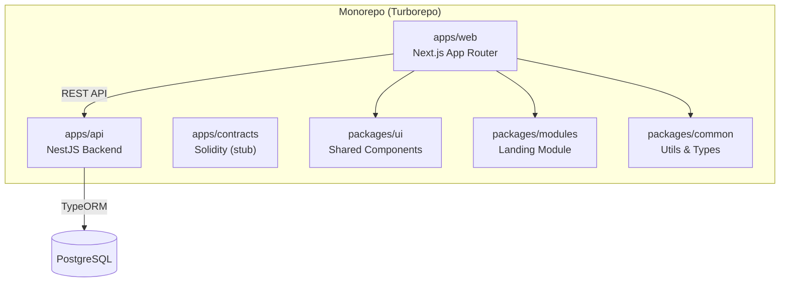
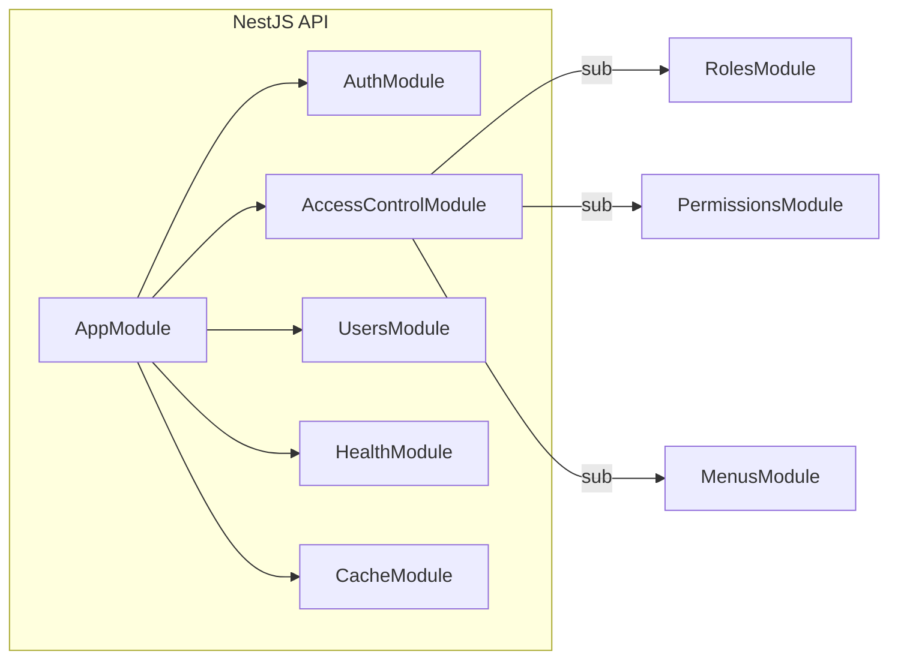

# Phase 1 — MBG Vendor Platform: Codebase Audit Report

## 1. Architecture Overview

| Layer | Tech | Status |
|-------|------|--------|
| Frontend | Next.js 15 (App Router), React, TypeScript | ✅ Active |
| Backend | NestJS, TypeORM, PostgreSQL | ✅ Active |
| Auth | JWT + CASL RBAC + Cookies | ✅ Working |
| UI Kit | shadcn/ui components in `packages/ui` | ✅ Comprehensive |
| Smart Contracts | Solidity (Hardhat) | ⚠️ Stub only |
| AI/RAG | None | 🔴 Not started |

---

## 2. Complete Page & Route Inventory

### 2.1 Public Pages (No Auth Required)

| Route | Component | Lines | API? | Status |
|-------|-----------|-------|------|--------|
| `/` | Landing page (6 sections via `@workspace/modules/landing`) | 23 | ❌ | ✅ Complete UI |
| `/login` | Email/password form, SSO stub, "Remember Me" | 258 | ✅ `authService.login()` | ✅ Working |
| `/register` | Role selection gateway (Vendor/Supplier/School/Parent/Admin) | 163 | ❌ | ✅ Complete UI |
| `/register/vendor` | 3-step form (Profile → Legal/AI → Capacity) | 338 | ❌ | ⚠️ UI only, no submit |
| `/register/supplier` | 3-step form (Profile → Legal → Physical/Stock) | 331 | ❌ | ⚠️ UI only, no submit |

### 2.2 Portal Pages (Auth Required — Dynamic Sidebar)

| Route | Page Name | Lines | Primary Role | API? | Status |
|-------|-----------|-------|-------------|------|--------|
| `/portal` | Role-based Dashboard Hub | 379 | All | ❌ | ⚠️ Hardcoded mock |
| `/portal/map` | Peta Sebaran Mitra SPPG | 256 | Admin/Vendor | ❌ | ⚠️ Mock map + data |
| `/portal/marketplace` | Direktori Supplier MBG | 183 | Vendor | ❌ | ⚠️ Mock supplier cards |
| `/portal/menu` | Penyusunan Menu & Nutrisi | 304 | Vendor | ❌ | ⚠️ Interactive calc, no save |
| `/portal/operasional/jadwal` | Kalender Perencanaan SPPG | 502 | Vendor | ❌ | ⚠️ Mock weekly calendar |
| `/portal/live` | Panel Eksekusi Checkpoint AI | 333 | Vendor | ❌ | ⚠️ Simulated CP flow |
| `/portal/checkpoints` | Pemantauan Skor & Kepatuhan | 491 | Vendor | ❌ | ⚠️ Mock score/penalty |
| `/portal/sop` | Pusat Panduan & Kepatuhan | 238 | Vendor | ❌ | ✅ Static reference |
| `/portal/incidents` | Pusat Kendali Insiden AI | 485 | Vendor | ❌ | ⚠️ Simulated camera + diagnostics |
| `/portal/funds` | Transparansi & Pencairan Dana | 292 | Admin/Publik | ❌ | ⚠️ Mock charts + ledger |
| `/portal/logistics` | Pemantauan Logistik MBG | 309 | Admin/Vendor | ❌ | ⚠️ Mock GPS + timeline |
| `/portal/audit` | Arsip Validasi & Audit AI | 195 | Admin | ❌ | ⚠️ Mock audit logs |
| `/portal/reports` | Analitik AI & Kepatuhan Gizi | 330 | Admin | ❌ | ⚠️ Mock charts + table |
| `/portal/settings` | Profil & Pengaturan | 299 | All | ❌ | ⚠️ Mock profile + 2FA |
| `/portal/supplier/shop` | Etalase Toko (Supplier) | 206 | Supplier | ❌ | ⚠️ Mock shop profile |
| `/portal/supplier/products` | Katalog Produk (Supplier) | 224 | Supplier | ❌ | ⚠️ Mock product list |
| `/portal/supplier/chat` | Chat Vendor–Supplier | ~317 | Supplier | ❌ | ⚠️ Mock chat UI |

### 2.3 Admin Pages (RBAC-Protected: `admin_bgn`)

| Route | Page Name | Lines | API? | Status |
|-------|-----------|-------|------|--------|
| `/portal/admin` | Admin Dashboard (stats + charts) | 400 | ✅ `rolesService`, `permissionsService`, `menusService` | ✅ Working |
| `/portal/admin/roles` | Role Management | ~471 | ✅ `rolesService.getAll()` | ✅ Working |
| `/portal/admin/permissions` | Permission Management | ~227 | ✅ `permissionsService` | ✅ Working |
| `/portal/admin/menus` | Menu Tree Management | 1325 | ✅ `menusService` | ✅ Working |

---

## 3. API Modules (`apps/api/src`)

| Module | Purpose | Entities/Tables | Used by Frontend? |
|--------|---------|-----------------|-------------------|
| `auth` | Login, JWT, refresh, CASL abilities | User, RefreshToken | ✅ Login page |
| `access-control/roles` | CRUD roles | Role | ✅ Admin roles page |
| `access-control/permissions` | CRUD permissions | Permission | ✅ Admin permissions page |
| `access-control/menus` | Menu tree CRUD | Menu | ✅ Admin menus + sidebar |
| `users` | User CRUD, activation | User | ✅ Admin users |
| `health` | Health check endpoint | — | ❌ Internal |
| `cache` | Caching utilities | — | ❌ Internal |

> [!IMPORTANT]
> **No API modules exist for:** Vendors, Suppliers, Schools, Products, Orders, Checkpoints, Incidents, Funds, Logistics, Menu Planning, or any operational domain entity. The entire operational domain is frontend-only with hardcoded mock data.

---

## 4. Auth & RBAC System

| Component | Location | Detail |
|-----------|----------|--------|
| Auth Provider | [use-auth.tsx](file:///d:/development/bi-hackathon/apps/web/hooks/use-auth.tsx) | Context-based, stores JWT in cookies, user in `localStorage` |
| CASL Abilities | [casl.ts](file:///d:/development/bi-hackathon/apps/web/lib/casl.ts) | `defineAbilitiesFor(role)` — role-based permissions |
| CASL Factory (API) | `apps/api/src/modules/auth/casl-ability.factory.ts` | Server-side ability definitions |
| User Roles | `@workspace/common` → `UserRole` enum | `VENDOR`, `SUPPLIER`, `SCHOOL`, `PUBLIC`, `ADMIN` (+ variants) |
| Dynamic Sidebar | [portal/layout.tsx](file:///d:/development/bi-hackathon/apps/web/app/portal/layout.tsx) | Menus fetched via `useUserMenu()` hook, filtered by CASL permissions |
| Admin Guard | [admin/layout.tsx](file:///d:/development/bi-hackathon/apps/web/app/portal/admin/layout.tsx) | Checks `localStorage` for `admin_bgn` role |

> [!WARNING]
> **Admin guard is client-side only** — checks `localStorage`, which can be spoofed. Server-side middleware/guard is recommended.

---

## 5. Role → Page Access Matrix

| Page | Vendor | Supplier | Sekolah | Admin | Publik |
|------|--------|----------|---------|-------|--------|
| Landing `/` | ✅ | ✅ | ✅ | ✅ | ✅ |
| Login/Register | ✅ | ✅ | ✅ | ✅ | ✅ |
| Portal Dashboard | ✅ | ✅ | ❌ | ✅ | ❌ |
| Menu Planning | ✅ | — | — | 👁️ | — |
| Schedule/Jadwal | ✅ | — | — | 👁️ | — |
| Live Checkpoint | ✅ | — | — | 👁️ | — |
| Checkpoints/Skor | ✅ | — | — | 👁️ | — |
| SOP Guide | ✅ | ✅ | — | ✅ | — |
| Incidents | ✅ | — | — | 👁️ | — |
| Map | ✅ | — | — | ✅ | 👁️ |
| Marketplace | ✅ | — | — | — | — |
| Supplier Shop | — | ✅ | — | — | — |
| Supplier Products | — | ✅ | — | — | — |
| Supplier Chat | — | ✅ | — | — | — |
| Funds | — | — | — | ✅ | 👁️ |
| Logistics | — | — | — | ✅ | — |
| Audit | — | — | — | ✅ | — |
| Reports | — | — | — | ✅ | — |
| Settings | ✅ | ✅ | ✅ | ✅ | — |
| Admin (Roles/Perms/Menus) | — | — | — | ✅ | — |

*✅ = Full access, 👁️ = View-only, — = No access (expected)*

> [!NOTE]
> Access control is currently **sidebar-driven** (dynamic menu), not enforced per-route with middleware. Any authenticated user could technically navigate to any `/portal/*` URL.

---

## 6. Feature Completeness Assessment

### ✅ KEEP (Working & Connected)
| Feature | Notes |
|---------|-------|
| Auth (Login/Logout) | JWT-based, CASL permissions, cookie storage |
| Admin RBAC (Roles/Permissions/Menus) | Full CRUD via API, tree-based menu editor |
| Dynamic Sidebar | API-driven, respects role permissions |
| Landing Page | Modular architecture (`@workspace/modules`) |
| UI Component Library | 15+ reusable shadcn/ui components |

### ⚠️ ENHANCE (UI exists, needs backend wiring)
| Feature | What Exists | What's Missing |
|---------|-------------|----------------|
| Vendor Registration | 3-step form UI | API endpoint, DB entity, form submission |
| Supplier Registration | 3-step form UI | API endpoint, DB entity, form submission |
| Portal Dashboard | Role-specific views | Real data from API, dynamic stats |
| Settings Page | Profile/2FA/Sessions UI | API integration, actual 2FA |
| Supplier Shop | Profile editor UI | API CRUD, file upload |
| Supplier Products | Product listing UI | API CRUD, image upload |

### 🔨 BUILD NEW (UI mockup only, no backend at all)
| Feature | Current State | Backend Needed |
|---------|--------------|----------------|
| Menu Planning | Interactive nutrition calculator (client-side) | Menu entity, CRUD API, nutrition DB |
| Schedule/Jadwal | Mock weekly calendar | Schedule entity, school assignment API |
| Live Checkpoint | 4-step stepper simulation | Checkpoint entity, photo upload, AI validation API |
| Checkpoint Scoring | Mock score + penalty display | Scoring engine, penalty rules, real-time calc |
| Incidents | Operational + technical tab with camera mock | Incident entity, camera API, GPS validation |
| Map Distribution | Mock map with static pins | Map integration (Mapbox/Leaflet), geospatial queries |
| Marketplace | 3 supplier cards with mock data | Supplier search API, ratings, geolocation |
| Funds/Transparency | Mock charts + transaction table | Transaction entity, blockchain integration |
| Logistics | Mock GPS tracking + timeline | Fleet tracking, GPS API, route optimization |
| Audit Trail | Mock log table | Immutable audit log, blockchain hash verification |
| AI Reports | Mock compliance charts + anomaly cards | AI/ML pipeline, photo analysis, fraud detection |
| Supplier Chat | Mock chat UI | WebSocket/real-time messaging |
| School Registration | Route exists, no page | Full registration flow |

---

## 7. Shared Packages

| Package | Contents | Usage |
|---------|----------|-------|
| `packages/ui` | Button, Input, Card, Table, Select, Badge, Avatar, Tabs, Alert, ScrollArea, Checkbox, Label, Separator, Progress, Textarea | Used by all pages |
| `packages/modules` | `landing/` module (Navbar, Hero, Problem, Features, DashboardPreview, Cta) | Landing page only |
| `packages/common` | `UserRole` enum, `formatAddress()`, `sleep()`, `isValidAddress()`, `formatNumber()` | Auth + utils |

---

## 8. Critical Gaps & Risks

### 🔴 Architectural Gaps
1. **No operational domain entities** — No Vendor, Supplier, School, Product, Order, Checkpoint, or Menu entities in the API
2. **No route-level auth middleware** — Portal pages are accessible to any authenticated user regardless of role
3. **Client-side admin guard** — `localStorage` check is easily bypassed
4. **No SSO implementation** — Login button exists but is non-functional
5. **No file/image upload** — Many pages reference photo upload but no infrastructure exists

### 🟡 Technical Debt
1. **All portal pages use hardcoded mock data** (15+ pages)
2. **No form validation on registration submit** — Forms are UI-only
3. **Custom SVG icons inline** — Several pages define `Flame`, `Lock`, `Users`, `CheckCircle` as inline SVGs instead of importing from lucide-react
4. **No error boundaries** — No global or per-page error handling
5. **No loading states** — Pages don't show skeleton loaders during data fetch
6. **No pagination** — Tables show 3-4 hardcoded rows

### 🟢 Strengths
1. **Consistent design system** — All pages follow the same visual language (rounded cards, uppercase labels, bold typography)
2. **Comprehensive UI coverage** — Full user journey is prototyped across 20+ pages
3. **Interactive nutrition calculator** — Menu planning page has working client-side calorie/protein computation
4. **Well-structured auth** — CASL abilities + dynamic sidebar is production-ready
5. **Monorepo setup** — Clean separation of concerns across packages

---

## 9. AI/RAG Integration Opportunities

| Opportunity | Where in Codebase | Feasibility |
|-------------|-------------------|-------------|
| **Photo Verification (Computer Vision)** | `/portal/live` checkpoint steps, `/portal/incidents` camera | High — mentioned in SOP page, UI ready |
| **Nutrition Compliance Check** | `/portal/menu` calculator, `/portal/reports` compliance | High — structured data available |
| **Fraud Detection** | `/portal/reports` anomaly cards, `/portal/checkpoints` scoring | Medium — needs operational data first |
| **GPS Route Anomaly** | `/portal/logistics` GPS tracking | Medium — needs real GPS data |
| **RAG for SOP/Regulation** | `/portal/sop` knowledge base | High — self-contained, good first AI feature |
| **Smart Supplier Matching** | `/portal/marketplace` supplier search | Medium — needs supplier + vendor data |

> [!TIP]
> **Recommended first AI integration:** RAG-powered SOP assistant. The SOP page already has structured operational rules (penalty matrix, checkpoint flow, photo guidelines). A chatbot that answers vendor questions about SOP compliance would be high-value and low-risk.
