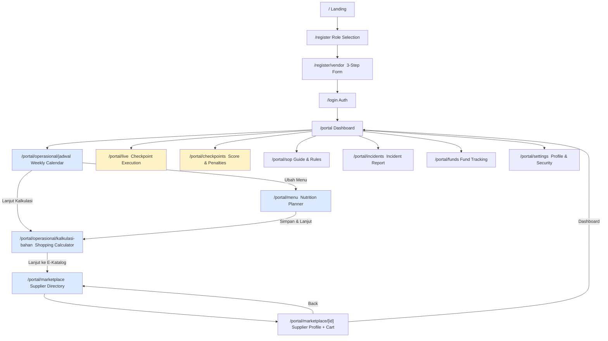
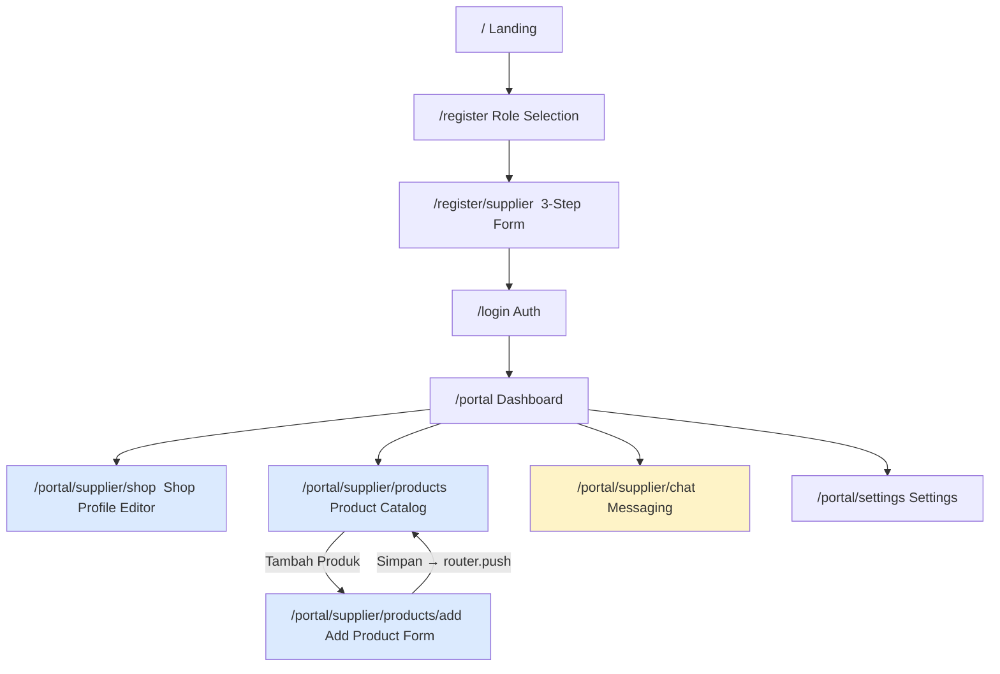
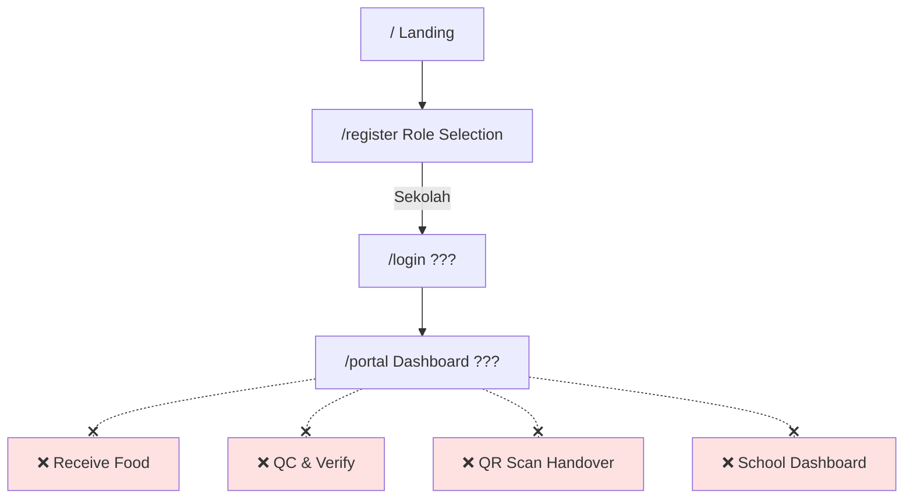
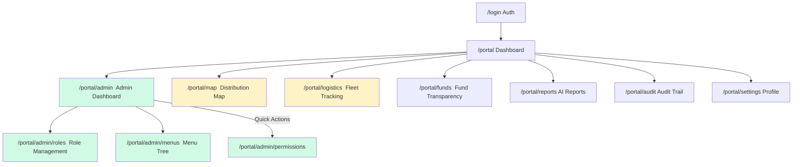

# Phase 2 — User Journey Mapping

## Overview

This document maps the **end-to-end journeys** for each user role, based on actual inter-page links (`href`, `router.push`) found in the codebase. Gaps are flagged where flows are broken or missing.

---

## 1. 🏭 Vendor Journey

The most developed journey — covers onboarding through daily operations to payout.

### Vendor Journey Steps

| # | Stage | Page | Link Exists? | Status |
|---|-------|------|-------------|--------|
| 1 | **Discover** | `/` Landing | ✅ | Complete |
| 2 | **Register** | `/register` → `/register/vendor` | ✅ `router.push` | ⚠️ UI only, no API |
| 3 | **Login** | `/login` | ✅ `authService.login()` | ✅ Working |
| 4 | **Dashboard** | `/portal` | ✅ Auto-redirect after login | ⚠️ Mock data |
| 5 | **Plan Schedule** | `/portal/operasional/jadwal` | ✅ Via sidebar | ⚠️ Mock calendar |
| 6 | **Design Menu** | `/portal/menu` | ✅ Link from jadwal | ⚠️ Interactive calc, no save |
| 7 | **Calculate Logistics** | `/portal/operasional/kalkulasi-bahan` | ✅ Link from jadwal + menu | ⚠️ Interactive calc, no save |
| 8 | **Source Ingredients** | `/portal/marketplace` → `[supplierId]` | ✅ Link from kalkulasi | ⚠️ Mock data, but has cart! |
| 9 | **Create PO** | Marketplace detail → "Buat PO" button | ✅ Button exists | 🔴 No API, no PO entity |
| 10 | **Execute Checkpoints** | `/portal/live` | ✅ Via sidebar | ⚠️ Simulated 4-step checkpoint |
| 11 | **Monitor Score** | `/portal/checkpoints` | ✅ Via sidebar | ⚠️ Mock score/penalties |
| 12 | **Report Incidents** | `/portal/incidents` | ✅ Via sidebar | ⚠️ Simulated camera+diagnostics |
| 13 | **Track Funds** | `/portal/funds` | ✅ Via sidebar | ⚠️ Mock charts |
| 14 | **Review SOP** | `/portal/sop` | ✅ Via sidebar | ✅ Static content (complete) |
| 15 | **Settings** | `/portal/settings` | ✅ Via sidebar profile | ⚠️ Mock data |

### Vendor Journey Gaps

> [!CAUTION]
> **Critical path broken at step 9** — The entire planning pipeline (jadwal → menu → kalkulasi → marketplace → PO) has beautifully chained navigation, but the final action "Buat PO" hits a dead end with no API.

| Gap | Severity | Detail |
|-----|----------|--------|
| Registration has no submit | 🔴 Critical | Vendor form doesn't call any API |
| No PO/Order entity | 🔴 Critical | Cart exists in UI but no backend |
| Checkpoint has no real camera/photo | 🔴 Critical | Core value prop is unimplemented |
| Score/penalty has no backend calculation | 🟡 High | Key compliance feature is mocked |
| Menu save doesn't persist | 🟡 High | Nutrition calculator is client-only |
| No notification system | 🟡 Medium | No alerts for schedule, orders, penalties |

---

## 2. 📦 Supplier Journey

Second most developed journey — covers shop setup and order management.

### Supplier Journey Steps

| # | Stage | Page | Link Exists? | Status |
|---|-------|------|-------------|--------|
| 1 | **Register** | `/register/supplier` | ✅ `router.push` | ⚠️ UI only, no API |
| 2 | **Login** | `/login` | ✅ | ✅ Working |
| 3 | **Dashboard** | `/portal` (SupplierDashboard) | ✅ | ⚠️ Mock data |
| 4 | **Setup Shop** | `/portal/supplier/shop` | ✅ Via sidebar | ⚠️ Mock + no API save |
| 5 | **Manage Products** | `/portal/supplier/products` | ✅ Via sidebar | ⚠️ Mock product list |
| 6 | **Add Product** | `/portal/supplier/products/add` | ✅ Link from products | ⚠️ Simulated save (setTimeout) |
| 7 | **Chat with Vendors** | `/portal/supplier/chat` | ✅ Via sidebar | ⚠️ Mock messages |
| 8 | **Receive Orders** | ❌ No page | — | 🔴 Missing entirely |
| 9 | **Fulfill & Ship** | ❌ No page | — | 🔴 Missing entirely |
| 10 | **Track Payments** | ❌ No page | — | 🔴 Missing entirely |

### Supplier Journey Gaps

| Gap | Severity | Detail |
|-----|----------|--------|
| No order management | 🔴 Critical | Suppliers can't see or manage incoming POs |
| No fulfillment workflow | 🔴 Critical | No shipping/delivery confirmation |
| No payment tracking | 🔴 Critical | No supplier-side financial dashboard |
| Registration has no submit | 🔴 Critical | Form doesn't call any API |
| Shop profile doesn't persist | 🟡 High | Save button is `setTimeout` fake |
| Chat is not real-time | 🟡 High | No WebSocket, mock messages only |

---

## 3. 🏫 Sekolah (School) Journey

**Almost entirely missing.** Only a role option in registration exists.

### Sekolah Journey — What Exists vs What's Needed

| # | Stage | Exists? | Notes |
|---|-------|---------|-------|
| 1 | Register as School | ⚠️ Role option only | No `/register/school` form |
| 2 | Login | ✅ Generic login | Works for all roles |
| 3 | Dashboard | 🔴 Missing | No `SchoolDashboard` component |
| 4 | View delivery schedule | 🔴 Missing | — |
| 5 | Receive & scan QR | 🔴 Missing | Referenced in SOP (CP4) but no page |
| 6 | QC confirmation | 🔴 Missing | — |
| 7 | Report issues | 🔴 Missing | Could share `/portal/incidents` |
| 8 | View nutrition info | 🔴 Missing | — |

> [!WARNING]
> The **QR handover scan** is repeatedly referenced in concept pages (`/portal/live`, `/portal/sop`, `/portal/logistics`) but **no actual school-facing page exists** for this critical step.

---

## 4. 🛡️ Admin / BGN Journey

Well-connected for RBAC management; operational oversight pages exist but use mock data.

### Admin Journey Status

| # | Stage | Page | API Connected? | Status |
|---|-------|------|---------------|--------|
| 1 | **RBAC Management** | `/portal/admin/*` | ✅ Full CRUD | ✅ Production-ready |
| 2 | **Vendor Oversight** | ❌ No dedicated page | — | 🔴 Missing |
| 3 | **Distribution Map** | `/portal/map` | ❌ | ⚠️ Mock pins |
| 4 | **Logistics Monitor** | `/portal/logistics` | ❌ | ⚠️ Mock GPS + table |
| 5 | **Fund Tracking** | `/portal/funds` | ❌ | ⚠️ Mock charts |
| 6 | **AI Reports** | `/portal/reports` | ❌ | ⚠️ Mock anomaly cards |
| 7 | **Audit Trail** | `/portal/audit` | ❌ | ⚠️ Mock log table |
| 8 | **User Management** | ❌ No page in portal | — | 🔴 Missing (API exists) |
| 9 | **Vendor Verification** | ❌ No page | — | 🔴 Missing |

---

## 5. 👁️ Publik (Public) Journey

**Entirely missing.** No public-facing transparency pages exist outside the landing page.

| # | Intended Feature | Exists? |
|---|-----------------|---------|
| 1 | Public fund transparency dashboard | 🔴 Missing |
| 2 | Vendor compliance scoreboard | 🔴 Missing |
| 3 | Nutrition report viewer | 🔴 Missing |
| 4 | School delivery tracker | 🔴 Missing |

> [!NOTE]
> The `/portal/funds` page mentions "Buku besar publik" and references BPK (national audit board), suggesting it was designed with public transparency in mind. This could be adapted as a read-only public page.

---

## 6. Cross-Role Navigation Map

The following table shows how pages connect to each other via actual `<Link>` or `router.push`:

| From Page | To Page | Link Type |
|-----------|---------|-----------|
| `/register` | `/register/vendor` | `router.push` |
| `/register` | `/register/supplier` | `router.push` |
| `/register/vendor` | `/login` | `router.push` (final step) |
| `/register/supplier` | `/login` | `router.push` (final step) |
| `/login` | `/portal` | `router.push` (on success) |
| `/portal/operasional/jadwal` | `/portal/menu` | `<Link>` (Ubah Menu) |
| `/portal/operasional/jadwal` | `/portal/operasional/kalkulasi-bahan` | `<Link>` (Lanjut Kalkulasi) |
| `/portal/menu` | `/portal/operasional/kalkulasi-bahan` | `<Link>` (Simpan & Lanjut) |
| `/portal/operasional/kalkulasi-bahan` | `/portal/marketplace` | `<Link>` (Lanjut ke E-Katalog) |
| `/portal/marketplace` | `/portal/marketplace/[id]` | `<Link>` (Lihat Profil) |
| `/portal/marketplace/[id]` | `/portal/marketplace` | `<Link>` (Back) |
| `/portal/marketplace/[id]` | `/portal` | `<Link>` (Dashboard) |
| `/portal/supplier/products` | `/portal/supplier/products/add` | `<Link>` |
| `/portal/supplier/products/add` | `/portal/supplier/products` | `router.push` (save) |
| `/portal/admin` | `/portal/admin/roles` | `<Link>` |
| `/portal/admin` | `/portal/admin/menus` | `<Link>` |
| Any portal page | `/portal/settings` | Sidebar profile link |

---

## 7. Priority Recommendations

### 🔴 Must-Build (Journey-Breaking Gaps)

| Priority | Item | Affected Roles |
|----------|------|---------------|
| P0 | **Registration API endpoints** (Vendor + Supplier) | Vendor, Supplier |
| P0 | **School-facing pages** (receive, QR scan, confirm) | Sekolah |
| P0 | **Order/PO entity + API** (connect cart to backend) | Vendor, Supplier |
| P1 | **Checkpoint photo upload + AI validation** | Vendor |
| P1 | **Scoring engine** (penalty calculation backend) | Vendor, Admin |
| P1 | **Supplier order management** (incoming POs, fulfillment) | Supplier |

### 🟡 Should-Build (Complete the Flows)

| Priority | Item | Affected Roles |
|----------|------|---------------|
| P2 | Menu planning persist to DB | Vendor |
| P2 | Admin vendor management page | Admin |
| P2 | Admin user management page (API exists) | Admin |
| P2 | Real-time chat (WebSocket) | Vendor, Supplier |
| P2 | Public transparency dashboard | Publik |

### 🟢 Nice-to-Have (Polish)

| Priority | Item | Affected Roles |
|----------|------|---------------|
| P3 | Map integration (Mapbox/Leaflet) | Admin, Vendor |
| P3 | GPS tracking for logistics | Admin |
| P3 | RAG-powered SOP assistant | Vendor |
| P3 | Notification system | All |
