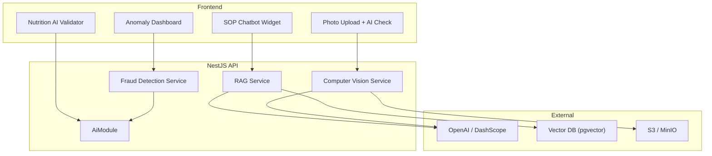
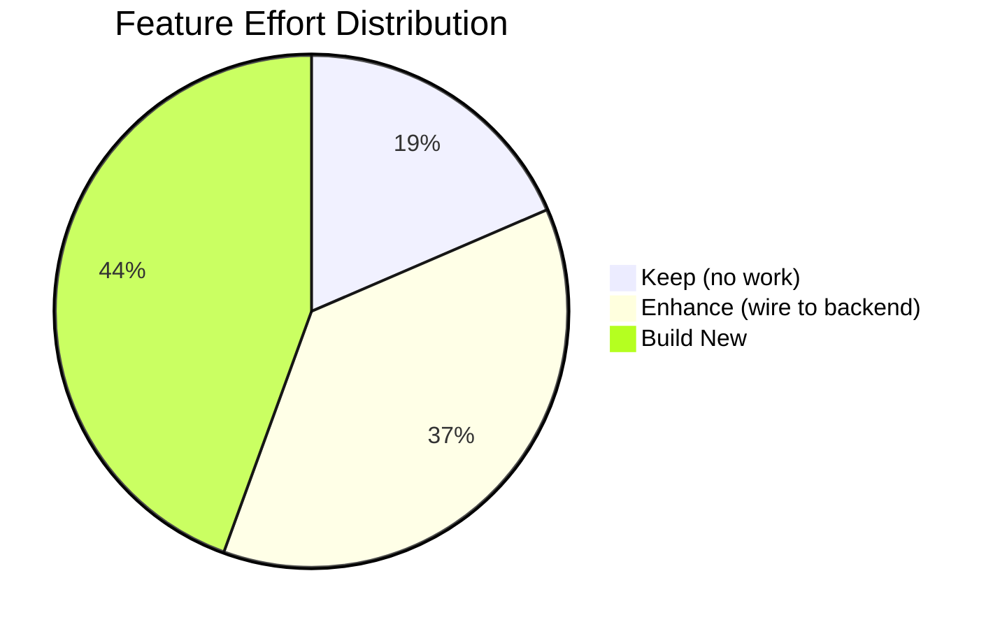

# Phase 3 — Feature Strategy & AI/RAG Roadmap

## Key Discovery

> [!IMPORTANT]
> The [SupplierSchema](file:///d:/development/bi-hackathon/apps/api/src/database/migrations/1710400000001-SupplierSchema.ts#3-629) migration (629 lines) contains a **production-grade DB schema** for the entire supplier/procurement flow — 10 tables, 7 triggers, 2 views, full RLS. This dramatically reduces "Build New" effort for the supplier domain.

### Already in DB (No Schema Work Needed)

| Table | Columns | Triggers | Notes |
|-------|---------|----------|-------|
| `suppliers` | 30+ cols (type, status, geo, certs, rating) | `set_updated_at` | Full lifecycle states |
| `supplier_documents` | 16 cols (type, hash, BPOM verify) | `set_updated_at` | Document verification |
| `supplier_products` | 15 cols (price, stock, BPOM, FTS) | search vector auto-sync | Full-text search ready |
| `supplier_product_photos` | 7 cols | — | Multi-photo with primary flag |
| `purchase_orders` | 25+ cols (PO number, status, negotiation, disputes) | auto-invoice, PO status log | 10-state lifecycle |
| `purchase_order_items` | 8 cols (qty, price, negotiated) | — | Line items |
| `po_status_logs` | 6 cols (from/to status, actor) | auto-trigger on PO update | Audit trail |
| `supplier_contracts` | 14 cols (PDF, signatures, validity) | `set_updated_at` | Digital contracts |
| `supplier_invoices` | 12 cols (auto-generated on delivery) | auto-generate trigger | Auto-invoice |
| `supplier_reviews` | 12 cols (5 sub-ratings, visibility) | rating sync, watch flag | Multi-dimensional rating |

**DB Views:** `supplier_catalog_view`, `po_dashboard_view`
**RLS Policies:** Admin, Supplier-own, Vendor-own, read-only grants

---

## 1. Feature Categorization

### ✅ KEEP — Production-Ready, No Changes Needed

| # | Feature | Pages | Evidence |
|---|---------|-------|----------|
| 1 | **Authentication (Login/Logout)** | `/login` | JWT + CASL + cookies, API connected |
| 2 | **Admin RBAC Management** | `/portal/admin/*` (4 pages) | Full CRUD, API connected, charts |
| 3 | **Dynamic Sidebar Navigation** | [portal/layout.tsx](file:///d:/development/bi-hackathon/apps/web/app/portal/layout.tsx) | API-driven via `useUserMenu()` |
| 4 | **Landing Page** | `/` | Modular architecture, complete UI |
| 5 | **SOP Reference Guide** | `/portal/sop` | Static content, well-organized tabs |

---

### ⚡ ENHANCE — UI Exists, Wire to Backend

| # | Feature | Effort | What Exists | What's Needed |
|---|---------|--------|-------------|---------------|
| 1 | **Vendor Registration** | 🟡 Medium | 3-step form UI (338 lines) | API endpoint, create vendor entity, form submit handler |
| 2 | **Supplier Registration** | 🟡 Medium | 3-step form UI (331 lines) | API endpoint (DB schema exists!), form submit handler |
| 3 | **Portal Dashboard** | 🟡 Medium | Role-specific views (379 lines) | Replace mock with API calls, use DB views |
| 4 | **Supplier Shop Profile** | 🟢 Low | Profile editor (206 lines) | NestJS `SuppliersModule` CRUD |
| 5 | **Supplier Product Catalog** | 🟢 Low | Product list + add form (452 lines total) | NestJS `ProductsModule` CRUD |
| 6 | **Marketplace Directory** | 🟡 Medium | Supplier cards + detail page (724 lines) | Query `supplier_catalog_view`, geospatial search |
| 7 | **Marketplace Cart → PO** | 🟡 Medium | Cart UI exists in supplier detail | NestJS `PurchaseOrdersModule`, connect "Buat PO" |
| 8 | **Menu Planning** | 🟡 Medium | Nutrition calculator works client-side | Menu entity, CRUD API, persist recipes |
| 9 | **Logistics Calculator** | 🟢 Low | Interactive table (246 lines) | Persist calculations, link to menu/jadwal |
| 10 | **Settings/Profile** | 🟢 Low | Profile + 2FA UI (299 lines) | Wire to `UsersModule`, add 2FA |

---

### 🔨 BUILD NEW — Significant Development Required

| # | Feature | Effort | Description | Dependencies |
|---|---------|--------|-------------|-------------|
| 1 | **Checkpoint Photo Upload + AI** | 🔴 High | Camera → upload → AI validation → score | File upload infra, CV model, scoring engine |
| 2 | **Scoring & Penalty Engine** | 🔴 High | Real-time score calculation, penalty rules | Checkpoint entity, rules engine, cron job |
| 3 | **School Portal (entire role)** | 🔴 High | Registration, delivery receipt, QR scan, QC confirm | School entity, QR gen/scan, notification system |
| 4 | **Real-time Chat** | 🟡 Medium | WebSocket messaging, vendor↔supplier | WebSocket gateway, message entity, presence |
| 5 | **Schedule/Jadwal Backend** | 🟡 Medium | Weekly planning, school assignment | Schedule entity, school-vendor mapping |
| 6 | **Map Integration** | 🟡 Medium | Mapbox/Leaflet with real vendor pins | Geospatial queries, coordinate data from suppliers table |
| 7 | **Fund Transparency Dashboard** | 🟡 Medium | APBN allocation, disbursement tracking | Transaction entity, payment integration |
| 8 | **Logistics/Fleet Tracking** | 🔴 High | GPS tracking, route optimization | GPS API, fleet entity, real-time updates |
| 9 | **Audit Trail System** | 🟡 Medium | Immutable logs of all validations | Audit entity, event sourcing |
| 10 | **AI Reports & Fraud Detection** | 🔴 High | Compliance analytics, anomaly detection | ML pipeline, training data, model deployment |
| 11 | **Incident Management** | 🟡 Medium | Reporting with photo evidence | Incident entity, file upload, notification |
| 12 | **Public Transparency Portal** | 🟡 Medium | Read-only view of funds, compliance, nutrition | Public API endpoints, data aggregation |

---

## 2. Prioritized Build Roadmap

### Sprint 1: Foundation (2 weeks) — "Connect What Exists"

| Task | Type | Effort | Impact |
|------|------|--------|--------|
| Create `SuppliersModule` (NestJS) | Enhance | 3–5 days | Unblocks 4 features |
| Create `ProductsModule` (NestJS) | Enhance | 2–3 days | Unblocks marketplace |
| Create `PurchaseOrdersModule` (NestJS) | Enhance | 3–5 days | Unblocks PO flow |
| Wire vendor registration form to API | Enhance | 1–2 days | Unblocks onboarding |
| Wire supplier registration form to API | Enhance | 1–2 days | Unblocks onboarding |

> [!TIP]
> The DB schema with views (`supplier_catalog_view`, `po_dashboard_view`), triggers (auto-invoice, rating sync), and RLS policies already exists. Sprint 1 is primarily **NestJS entity mapping + basic CRUD controllers**.

### Sprint 2: Core Operations (2 weeks) — "Make Vendor Day-to-Day Work"

| Task | Type | Effort | Impact |
|------|------|--------|--------|
| Menu entity + CRUD API | Enhance | 2–3 days | Persist menu planning |
| Schedule entity + planning API | Build New | 3–5 days | Weekly meal planning |
| Wire marketplace to `supplier_catalog_view` | Enhance | 2–3 days | Real supplier search |
| Wire cart → PO creation | Enhance | 1–2 days | Complete procurement flow |
| Dashboard API (aggregated metrics) | Enhance | 2–3 days | Replace all mock dashboard data |

### Sprint 3: Validation & School (2 weeks) — "Core Value Proposition"

| Task | Type | Effort | Impact |
|------|------|--------|--------|
| File upload infrastructure (S3/MinIO) | Build New | 2–3 days | Prerequisite for photos |
| Checkpoint entity + photo upload API | Build New | 3–5 days | Checkpoint execution |
| Scoring engine (penalty rules) | Build New | 3–5 days | Daily compliance scoring |
| School registration + portal pages | Build New | 5–7 days | Entire new role |
| QR generation + scan for handover | Build New | 2–3 days | School confirmation flow |

### Sprint 4: Intelligence & Transparency (2 weeks) — "Differentiation"

| Task | Type | Effort | Impact |
|------|------|--------|--------|
| AI photo validation (CV integration) | Build New | 5–7 days | Automated checkpoint QC |
| RAG-powered SOP assistant | Build New | 3–5 days | Vendor self-service |
| WebSocket chat (vendor↔supplier) | Build New | 3–5 days | Real-time negotiation |
| Public transparency dashboard | Build New | 3–5 days | Government accountability |
| Notification system | Build New | 2–3 days | Cross-role alerts |

---

## 3. AI/RAG Integration Roadmap

### Opportunity Matrix

| # | AI Feature | Placement | Data Available? | Effort | Impact | Priority |
|---|-----------|-----------|----------------|--------|--------|----------|
| 1 | **RAG SOP Assistant** | `/portal/sop` chatbot | ✅ SOP content in page | 🟢 Low (3–5 days) | 🟡 Medium | **P1 — Start here** |
| 2 | **Nutrition Compliance Checker** | `/portal/menu` validation | ✅ Client-side calc exists | 🟢 Low (2–3 days) | 🟡 Medium | **P1** |
| 3 | **Photo Checkpoint Validation** | `/portal/live` step 2–3 | ⚠️ Need photo upload first | 🔴 High (5–7 days) | 🔴 Critical | **P2** |
| 4 | **Smart Supplier Matching** | `/portal/marketplace` search | ✅ `supplier_catalog_view` + geospatial | 🟡 Medium (3–5 days) | 🟡 Medium | **P2** |
| 5 | **Fraud & Anomaly Detection** | `/portal/reports` analytics | ⚠️ Need operational data first | 🔴 High (7–10 days) | 🔴 Critical | **P3** |
| 6 | **GPS Route Anomaly Detection** | `/portal/logistics` alerts | 🔴 No GPS data yet | 🔴 High (7–10 days) | 🟡 Medium | **P4** |

---

### AI Integration Architecture (Proposed)

### AI Feature Details

#### P1: RAG SOP Assistant (Recommended First)

**Why first:** Self-contained, low-risk, high-value, can ship independently.

| Aspect | Detail |
|--------|--------|
| **Input** | SOP page content (penalty matrix, checkpoint rules, photo guidelines) |
| **Model** | OpenAI GPT-4o-mini or DashScope (already in codebase: `a1ea303d` conversation) |
| **Vector Store** | `pgvector` extension (PostgreSQL already in use) |
| **UX** | Floating chat widget on `/portal/sop` page |
| **Example queries** | "Berapa poin penalti untuk pengiriman terlambat?", "Apa saja yang harus ada di foto checkpoint?" |

#### P1: Nutrition Compliance Checker

| Aspect | Detail |
|--------|--------|
| **Input** | Menu ingredients + quantities from `/portal/menu` |
| **Logic** | Compare against PMK nutrition standards (calories, protein, fat targets) |
| **Model** | Rule-based + LLM for recommendation text |
| **UX** | Inline validation badge + AI suggestion in menu page |

#### P2: Photo Checkpoint Validation (Core Value Prop)

| Aspect | Detail |
|--------|--------|
| **Input** | Camera photo from `/portal/live` checkpoint steps |
| **Processing** | Upload to S3 → send to Vision API → classify (pass/fail/manual review) |
| **Model** | GPT-4o Vision or custom fine-tuned model |
| **Training Data** | Need to collect initial dataset of valid/invalid checkpoint photos |
| **Prerequisites** | File upload infra, checkpoint entity, scoring engine |

---

## 4. Effort Summary

| Category | Count | Estimated Total Effort |
|----------|-------|----------------------|
| ✅ Keep | 5 features | 0 days |
| ⚡ Enhance | 10 features | 15–25 days |
| 🔨 Build New | 12 features | 40–65 days |
| 🤖 AI/RAG | 6 opportunities | 25–40 days |
| **Total** | **33 items** | **~80–130 days** |

> [!NOTE]
> The "Enhance" effort is significantly lower than expected because the SupplierSchema migration already provides the full DB layer. The primary work is building NestJS modules (entities, controllers, services) and wiring frontend forms to these new endpoints.
