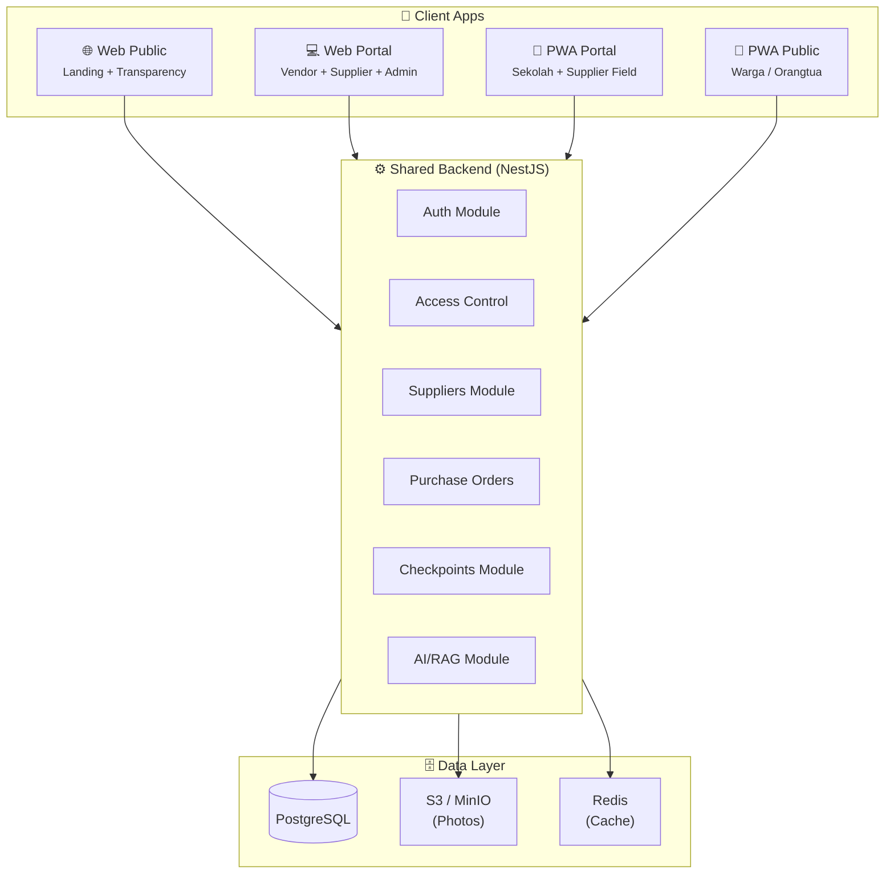
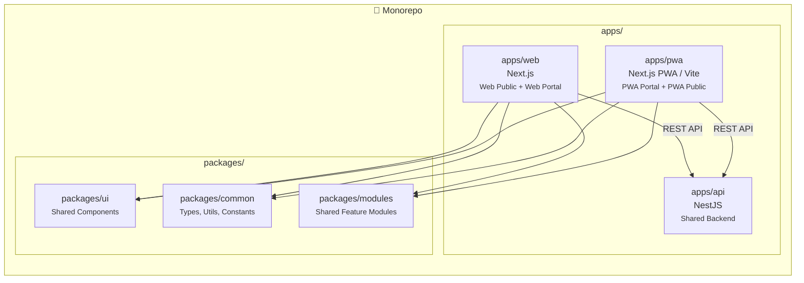

# Platform Architecture — Web vs PWA Distribution

## System Overview

---

## Page-to-Platform Mapping

### 🌐 Web Public — `apps/web` (unauthenticated routes)

> **Audience:** Siapa saja, tanpa login
> **Tech:** Next.js SSR/SSG untuk SEO
> **Device:** Desktop-first, responsive

| Page | Route | Fungsi |
|------|-------|--------|
| Landing | `/` | Homepage, fitur, CTA |
| Login | `/login` | Auth entry |
| Register Gateway | `/register` | Pilih role |
| Register Vendor | `/register/vendor` | Form registrasi vendor |
| Register Supplier | `/register/supplier` | Form registrasi supplier |
| **Transparansi Publik** | `/transparansi` | 🆕 Dashboard dana publik (read-only) |
| **Skor Vendor Publik** | `/transparansi/vendors` | 🆕 Scoreboard kepatuhan vendor |

---

### 💻 Web Portal — `apps/web` (authenticated `/portal/*`)

> **Audience:** Vendor, Supplier, Admin — di kantor/dapur (desktop)
> **Tech:** Next.js CSR with auth guards
> **Device:** Desktop-first, beberapa responsive

| Page | Route | Role | Loop Step |
|------|-------|------|-----------|
| Dashboard | `/portal` | All | — |
| Jadwal Mingguan | `/portal/operasional/jadwal` | Vendor | PLAN |
| Menu & Nutrisi | `/portal/menu` | Vendor | PLAN |
| Kalkulasi Bahan | `/portal/operasional/kalkulasi-bahan` | Vendor | SOURCE |
| Marketplace | `/portal/marketplace` | Vendor | SOURCE |
| Supplier Detail | `/portal/marketplace/[id]` | Vendor | SOURCE |
| Supplier Shop | `/portal/supplier/shop` | Supplier | — |
| Supplier Products | `/portal/supplier/products` | Supplier | — |
| Add Product | `/portal/supplier/products/add` | Supplier | — |
| Supplier Chat | `/portal/supplier/chat` | Supplier | — |
| Fund Tracking | `/portal/funds` | Admin | PAY |
| Reports & AI | `/portal/reports` | Admin | — |
| Audit Trail | `/portal/audit` | Admin | — |
| Map Distribution | `/portal/map` | Admin | — |
| Logistics | `/portal/logistics` | Admin | DELIVER |
| Admin RBAC | `/portal/admin/*` | Admin | — |
| Settings | `/portal/settings` | All | — |
| SOP Guide | `/portal/sop` | All | — |

---

### 📱 PWA Portal — `apps/pwa` (authenticated, mobile-first)

> **Audience:** Vendor (di lapangan), Supplier (gudang), Sekolah
> **Tech:** Next.js PWA atau standalone (Vite + PWA plugin)
> **Device:** Mobile-first, offline-capable, camera access

| Page | Route | Role | Loop Step | Why PWA? |
|------|-------|------|-----------|----------|
| **Live Checkpoint** | `/live` | Vendor | COOK & CHECK | 📸 Camera wajib, di dapur |
| **Photo Upload** | `/live/photo` | Vendor | COOK & CHECK | 📸 Upload langsung dari HP |
| **Incidents** | `/incidents` | Vendor | COOK & CHECK | 📸 Foto bukti insiden |
| **Daily Score** | `/checkpoints` | Vendor | SCORE | 📊 Cek skor cepat di HP |
| **School Confirm** | `/school/confirm` | Sekolah | DELIVER | 🆕 QR scan + receipt |
| **School Dashboard** | `/school` | Sekolah | — | 🆕 Lihat jadwal kirim |
| **School Nutrition** | `/school/nutrition` | Sekolah | — | 🆕 Info gizi menu hari ini |
| **Supplier Orders** | `/orders` | Supplier | SOURCE | 📦 Manage PO di gudang |
| **Supplier Delivery** | `/orders/[id]/deliver` | Supplier | DELIVER | 📸 Foto bukti kirim |
| **Quick Chat** | `/chat` | All | — | 💬 Chat di lapangan |

> [!IMPORTANT]
> PWA Portal menangani semua fitur yang **butuh kamera, GPS, atau akses cepat di lapangan**. Halaman yang sama (Live Checkpoint, Incidents) ada di Web Portal juga, tapi pengalaman utamanya di PWA.

---

### 📱 PWA Public — `apps/pwa` (unauthenticated, mobile-first)

> **Audience:** Warga, orangtua murid, jurnalis
> **Tech:** Same PWA shell, public routes
> **Device:** Mobile-first, shareable via link

| Page | Route | Fungsi |
|------|-------|--------|
| **Cek Sekolah** | `/public/school/[id]` | 🆕 Orangtua cek menu & jadwal di sekolah anaknya |
| **Skor Vendor** | `/public/vendor/[id]` | 🆕 Lihat skor kepatuhan vendor |
| **Lapor Masalah** | `/public/report` | 🆕 Warga lapor jika makanan tidak sampai |
| **Dashboard Publik** | `/public` | 🆕 Statistik nasional MBG |

---

## Arsitektur Lengkap

---

## Shared vs Platform-Specific

| Komponen | Web Portal | PWA Portal | Shared? |
|----------|-----------|------------|---------|
| `packages/ui` (Button, Card, dll) | ✅ | ✅ | ✅ Shared |
| `packages/common` (types, utils) | ✅ | ✅ | ✅ Shared |
| Auth hooks (`useAuth`, `usePermission`) | ✅ | ✅ | ✅ Bisa di `packages/` |
| Sidebar navigation | ✅ | ❌ | ❌ Web only (PWA pakai bottom nav) |
| Camera/Photo component | ⚠️ Basic | ✅ Full | ❌ PWA-optimized |
| Offline support | ❌ | ✅ | ❌ PWA only |
| QR Scanner | ❌ | ✅ | ❌ PWA only |
| Dashboard charts | ✅ Full | ✅ Summary | ⚠️ Shared chart lib, different layout |
| Admin RBAC pages | ✅ | ❌ | ❌ Web only |

---

## Keputusan Arsitektur

| Opsi | Kelebihan | Kekurangan | Rekomendasi |
|------|-----------|------------|-------------|
| **A) 1 Next.js app, PWA enabled** | Simple, shared routing | PWA overhead di semua page | ❌ |
| **B) 2 apps: `apps/web` + `apps/pwa`** | Optimal bundle per platform | Sedikit duplikasi routing | ✅ **Recommended** |
| **C) 3 apps: web + pwa-portal + pwa-public** | Maximum separation | Terlalu banyak apps | ❌ Overkill |

> [!TIP]
> **Rekomendasi: Opsi B** — `apps/web` handle Web Public + Web Portal;  `apps/pwa` handle PWA Portal + PWA Public. Shared melalui `packages/ui` dan `packages/common`. Backend tetap satu `apps/api`.
