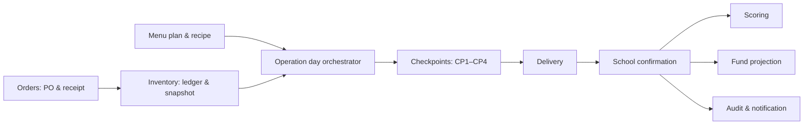

# Operation-Day Backend Design

**Status:** Approved for planning

**Owner:** Orang 1 — Platform/API

## Goal

Create one trustworthy, traceable backend workflow for a vendor's daily meal operation:

```text
Supplier catalog -> purchase order -> goods receipt -> kitchen inventory
-> menu/recipe -> CP1 -> CP2 -> CP3 -> delivery/CP4 -> school confirmation
-> operation-day close -> score, fund projection, audit, notification
```

The first milestone includes procurement and inventory. Fund data is a derived projection only; it does not integrate a real payment gateway or webhook.

## Non-goals

- Real payment processing, settlement, or BI SNAP integration.
- Replacing existing checkpoint, delivery, school-confirmation, scoring, or funds modules.
- Moving API clients or business rules to `apps/web`, `apps/pwa`, or `packages/ui`.
- A new live AI provider. The mock provider remains acceptable in demo environments through the same validation contract.

## Architecture

The design keeps domain ownership small and explicit:

- **Orders** owns purchase orders, their items, supplier decisions, dispatch, and vendor receipt.
- **Inventory** owns an append-only ledger and current-stock projection. It receives stock only from a goods receipt and reduces stock only from a documented consumption, waste, or stock-opname adjustment.
- **Menu plans** owns a vendor's menu, recipes, target portions, material requirements, and stock shortage calculation.
- **Operation day** is an orchestration aggregate. It owns the legal daily sequence and references the menu plan, stock consumption, checkpoints, delivery, and school confirmation. It does not duplicate data owned by the other domains.
- Existing **checkpoints**, **delivery**, **school-confirmation**, **scoring**, **funds**, **notifications**, and **realtime** modules retain their responsibilities and react to durable domain events.



## Aggregate states and invariants

### Purchase order

```text
draft -> submitted -> accepted | rejected -> dispatched -> received
```

- A vendor creates, submits, and confirms receipt of its own order.
- The addressed supplier accepts, rejects, and dispatches its own order.
- A receipt is the only event that creates a `goods_receipt` inventory-ledger entry.
- A rejected or received PO cannot be mutated further.

### Inventory ledger

Ledger entry types are `goods_receipt`, `consumption`, `waste`, and `stock_opname_adjustment`.

- The visible balance is calculated/projection data, never a directly mutable source of truth.
- Each entry has a vendor, product/material reference, unit, quantity delta, source aggregate type/id, actor, and timestamp.
- Duplicate source aggregate/type pairs must be prevented with a unique constraint where the source command is naturally one-time, such as a PO receipt.

### Operation day

```text
planned -> in_progress -> dispatched -> school_confirmed -> closed
```

- A vendor has at most one active operation day per local calendar date.
- `planned` becomes `in_progress` when CP1 succeeds.
- CP1 reserves/consumes the approved menu's material requirements from inventory; it cannot succeed with insufficient stock.
- CP2 and CP3 follow CP1. CP4 requires an active delivery belonging to the same operation day.
- School confirmation can occur only for the delivery generated from that operation day.
- Only a `school_confirmed` operation day may be closed.

### Incident and audit event

- An incident is opened automatically for a failed/warning checkpoint, delivery lateness, quantity mismatch, or reported school problem. It transitions `open -> acknowledged -> resolved`.
- Audit events are append-only and record actor, action, aggregate identity, timestamp, correlation id, and a sanitized before/after payload.

## Cross-module effects

| Durable event                              | Producer                  | Transactional state change                                                       | Consumers after commit                     |
| ------------------------------------------ | ------------------------- | -------------------------------------------------------------------------------- | ------------------------------------------ |
| `order.received`                           | Orders                    | PO becomes `received`; add `goods_receipt` ledger entries                        | Inventory projection, audit, notification  |
| `operation.cp1.completed`                  | Checkpoints/Operation day | consume inventory, save checkpoint evidence, operation day becomes `in_progress` | scoring signal, audit, notification        |
| `checkpoint.warning` / `checkpoint.failed` | Checkpoints               | save validation result                                                           | Incidents, scoring, audit, notification    |
| `delivery.completed`                       | Delivery                  | save proof and delivery status                                                   | audit, notification                        |
| `school.confirmed`                         | School confirmation       | save confirmation; operation day becomes `school_confirmed`                      | scoring readiness, audit, notification     |
| `operation.closed`                         | Operation day             | operation day becomes `closed`; persist score/fund projection                    | command center, public aggregate, realtime |

The producer writes both its domain mutation and an outbox/audit event in the same database transaction. Socket.IO and email are post-commit adapters; they can retry without changing business state.

## API contract v1

All mutation endpoints require JWT authentication except existing public/token-scoped school-confirmation reads and confirmations. Mutations use an `Idempotency-Key` header. Reusing a key with the same authenticated user and request fingerprint returns the original result; using it with a different payload returns `409`.

| Method | Route                       | Role               | Result                                                          |
| ------ | --------------------------- | ------------------ | --------------------------------------------------------------- |
| `POST` | `/orders`                   | vendor             | Create a draft/submitted PO and items from live supplier prices |
| `GET`  | `/orders/my`                | vendor             | Paginated vendor PO list and status timeline                    |
| `GET`  | `/orders/supplier`          | supplier           | Paginated incoming supplier PO list                             |
| `POST` | `/orders/:id/accept`        | addressed supplier | Accept submitted PO                                             |
| `POST` | `/orders/:id/reject`        | addressed supplier | Reject submitted PO with reason                                 |
| `POST` | `/orders/:id/dispatch`      | addressed supplier | Mark accepted PO dispatched with delivery reference             |
| `POST` | `/orders/:id/receive`       | purchasing vendor  | Create receipt and inventory ledger entries                     |
| `GET`  | `/inventory/current`        | vendor             | Current inventory with provenance and balance                   |
| `POST` | `/inventory/opname`         | vendor             | Append a documented stock-opname adjustment                     |
| `GET`  | `/menu-plans/:date`         | vendor             | Menu, recipe requirements, stock availability, shortages        |
| `POST` | `/menu-plans`               | vendor             | Create/update a vendor menu plan and recipe requirements        |
| `GET`  | `/operation-days/today`     | vendor             | Active daily context and allowed next command                   |
| `POST` | `/operation-days`           | vendor             | Create daily context from a valid menu plan                     |
| `POST` | `/operation-days/:id/close` | vendor             | Close only a school-confirmed operation day                     |

Existing checkpoint, delivery, and school-confirmation responses gain `operationDayId` and `eventId` without removing existing fields. Their write endpoints resolve and validate the matching operation day from their current relationship; clients do not set an arbitrary operation-day foreign key.

Error semantics are consistent across new and amended endpoints:

- `400`: malformed request or missing required data.
- `403`: caller lacks the assigned vendor, supplier, or admin ownership.
- `404`: aggregate or token does not exist for this caller.
- `409`: illegal state transition, duplicate one-time command, or incompatible idempotency key reuse.
- `422`: domain validation failure, including insufficient inventory or an incomplete menu plan.

## Reliability, privacy, and operations

- Each command uses a database transaction. A PO cannot be `received` if its ledger write fails; an operation day cannot advance when checkpoint evidence fails to persist.
- Checkpoint uploads are limited by MIME/size and stored using the existing storage module. Persisted references use object keys or signed URLs, never public bucket credentials.
- Retried mobile uploads and confirmations use idempotency. The original command result is returned instead of creating a second receipt, checkpoint, score event, or confirmation.
- Audit payloads exclude passwords, tokens, raw signed URLs, and unnecessary PII. Public projections expose only aggregate/approved traceability fields.
- Every workflow command carries a correlation id in logs and events, allowing command center investigation from operation day to PO and school confirmation.

## Acceptance tests

1. Vendor submits a PO; only the addressed supplier can accept/dispatch; vendor receipt creates one ledger increase.
2. A second receipt or idempotency retry does not create a second ledger entry.
3. A vendor creates a menu plan and operation day; CP1 succeeds only with sufficient stock and creates documented consumption.
4. CP2/CP3 cannot occur before CP1; CP4 cannot occur without an operation-day delivery.
5. An expired or previously used school token cannot close a delivery or operation day.
6. A valid school confirmation permits closure and produces score, fund projection, audit event, and notification exactly once.
7. Another vendor/supplier cannot read or mutate these aggregates.
8. A checkpoint warning/failure and a school problem create an incident linked to the operation day.

## Delivery order

1. Establish e2e seed data, DTOs/enums, ownership guards, and endpoint examples for the UI team.
2. Implement orders and receipt-backed inventory ledger.
3. Implement menu plans and operation-day orchestration.
4. Amend checkpoints, delivery, and school confirmation to use the operation day.
5. Derive score, funds, audit, notifications, command-center/public projections; then run the complete e2e scenario.
